집합론은 현대 수학의 공통 언어이다. 수, 함수, 공간, 관계, 구조를 모두 어떤 방식으로든 **집합**의 언어로 다룰 수 있기 때문이다. 철학적으로도 집합론은 중요하다. 존재자를 분류하고, 속성과 관계를 구분하고, 구조를 형식적으로 다루는 훈련이 되기 때문이다. 다만 집합론 전체를 깊게 파는 것이 항상 필요한 것은 아니다. 먼저 핵심 개념을 정확히 익히는 것이 더 중요하다.

이 글은 Halmos의 *Naive Set Theory* 같은 고전 입문서를 참고하되, 내용을 독립적으로 재구성한 **개념 중심 입문 노트**이다. 원문의 문장이나 전개를 그대로 옮기지 않고, 집합론의 핵심 아이디어를 웹용 학습 자료로 다시 정리했다.

---

## 1. 집합이란 무엇인가

집합(set)은 어떤 대상들의 **모임**을 하나의 대상으로 본 것이다. 집합에 들어 있는 대상 하나하나를 **원소(element)** 라고 한다.

- a ∈ A : 원소 a가 집합 A에 속한다.
- a ∉ A : 원소 a가 집합 A에 속하지 않는다.

예:

- A = {1, 2, 3}
- 1 ∈ A
- 4 ∉ A

### 핵심 관점

집합론에서는 원소가 중요하다. 집합의 정체성은 “이름”보다 “무슨 원소를 가지는가”에 의해 결정된다.

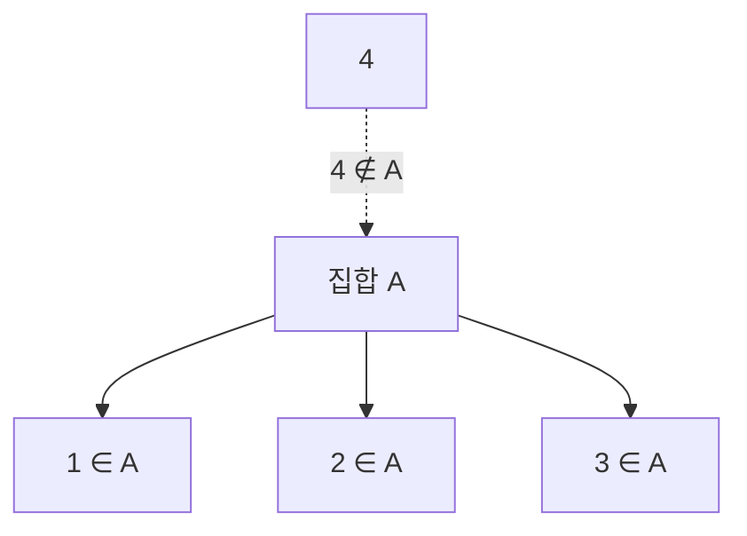

---

## 2. 외연 공리: 집합의 동일성

두 집합은 원소가 완전히 같으면 동일하다.

$$
A = B \iff \forall x\,(x \in A \leftrightarrow x \in B)
$$

이 원리는 집합의 동일성을 판단하는 가장 기본적인 기준이다. 실전에서는 다음 방식으로 자주 쓴다.

1. A ⊆ B를 보인다.
2. B ⊆ A를 보인다.
3. 따라서 A = B이다.

### 왜 중요한가

집합은 겉모양이 아니라 **포함하는 원소**로 규정된다. 따라서 순서나 중복은 본질이 아니다.

- {1,2,3} = {3,2,1}
- {1,1,2,3} = {1,2,3}

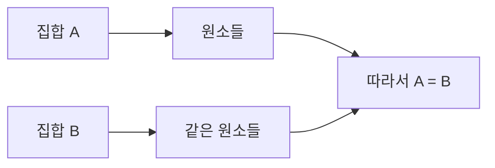

---

## 3. 부분집합과 멱집합

집합 A의 모든 원소가 B에도 들어 있으면 A는 B의 **부분집합**이다.

$$
A \subseteq B \iff \forall x\,(x \in A \rightarrow x \in B)
$$

예:

- {1,2} ⊆ {1,2,3}
- ∅ ⊆ A (공집합은 모든 집합의 부분집합이다)

집합 A의 모든 부분집합들의 집합을 **멱집합**이라고 하며 $\mathcal{P}(A)$ 또는 $P(A)$로 쓴다.

예를 들어 A = {1,2} 이면

$$
\mathcal{P}(A)=\lbrace\varnothing,\lbrace 1\rbrace,\lbrace 2\rbrace,\lbrace 1,2\rbrace\rbrace
$$

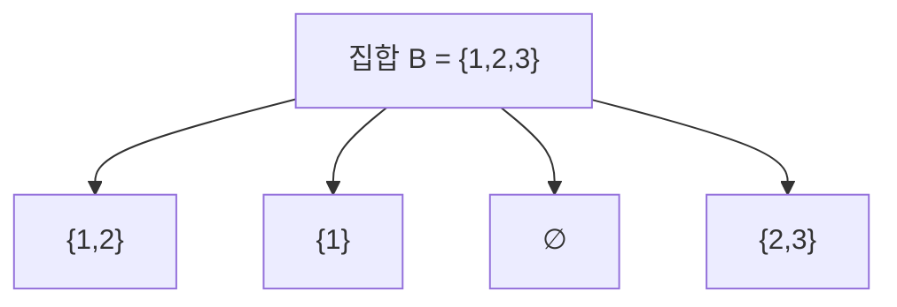

### 직관 포인트

- 부분집합: “안에 들어 있는 작은 집합”
- 멱집합: “가능한 모든 부분집합의 목록”

---

## 4. 기본 연산: 합집합, 교집합, 차집합

집합에는 논리와 비슷한 기본 연산이 있다.

### 합집합

$$
A \cup B = \lbrace x \mid x\in A \text{ 또는 } x\in B \rbrace
$$

### 교집합

$$
A \cap B = \lbrace x \mid x\in A \text{ 그리고 } x\in B \rbrace
$$

### 차집합

$$
A \setminus B = \lbrace x \mid x\in A \text{ 이고 } x\notin B \rbrace
$$

### 여집합

전체집합 U가 주어졌을 때

$$
A^c = U\setminus A
$$

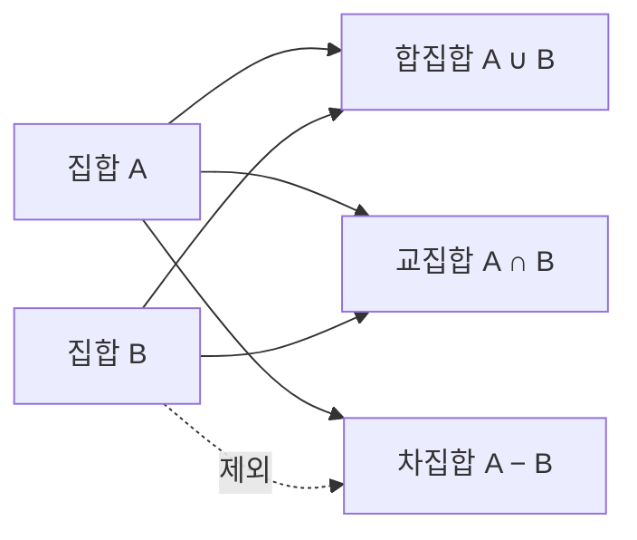

### 논리와의 유비

- 합집합 ↔ 논리합(OR)
- 교집합 ↔ 논리곱(AND)
- 여집합 ↔ 부정(NOT)

---

## 5. 소박한 집합론과 공리적 집합론

초보 단계에서는 보통 “대상들을 모아 집합을 만든다”는 식으로 생각해도 충분하다. 이것을 흔히 **소박한 집합론(naive set theory)** 라고 부른다.

하지만 아무 조건으로나 집합을 만들 수 있다고 하면 문제가 생긴다. 대표적인 것이 **러셀의 역설**이다.

### 러셀의 역설 아이디어

$R = \lbrace x \mid x \notin x \rbrace$ 라는 집합을 생각해 보자.

이제 R ∈ R 인지 물으면 모순이 생긴다.

- 만약 R ∈ R 이면, 정의에 따라 R ∉ R
- 만약 R ∉ R 이면, 정의에 따라 R ∈ R

따라서 아무 성질로나 집합을 만들 수는 없다.

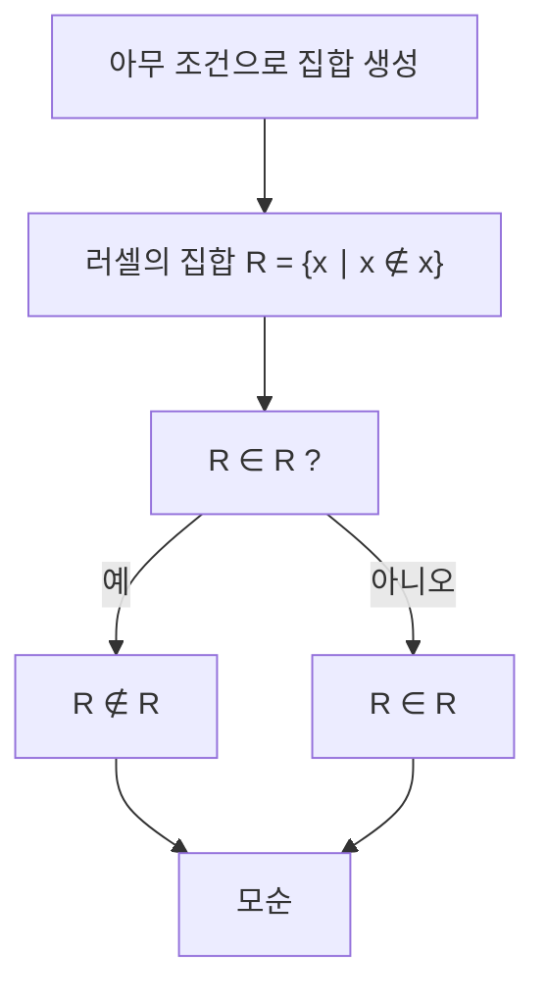

### 그래서 왜 공리가 필요한가

공리적 집합론은 “어떤 집합이 존재하는가”를 제한된 규칙으로 다룬다. 보통 ZF 또는 ZFC 체계를 사용한다.

대표 공리들:

- 외연 공리
- 공집합 공리
- 짝집합 공리
- 합집합 공리
- 멱집합 공리
- 분리 공리
- 치환 공리
- 무한 공리
- 정칙성 공리
- 선택 공리(AC)

엄밀한 집합론을 깊게 배우지 않더라도, **왜 공리가 필요한지** 정도는 알아두는 것이 좋다.

---

## 6. 순서쌍과 데카르트 곱

집합만으로는 “순서”를 표현하기 어렵다. 그래서 **순서쌍** (a,b)를 도입한다.

핵심 성질은 다음과 같다.

$$
(a,b)=(c,d) \iff a=c \text{ 이고 } b=d
$$

이를 바탕으로 **데카르트 곱**을 정의한다.

$$
A \times B = \lbrace (a,b) \mid a\in A,\, b\in B \rbrace
$$

예:

$$
\lbrace 1,2\rbrace\times\lbrace x,y\rbrace = \lbrace (1,x),(1,y),(2,x),(2,y)\rbrace
$$

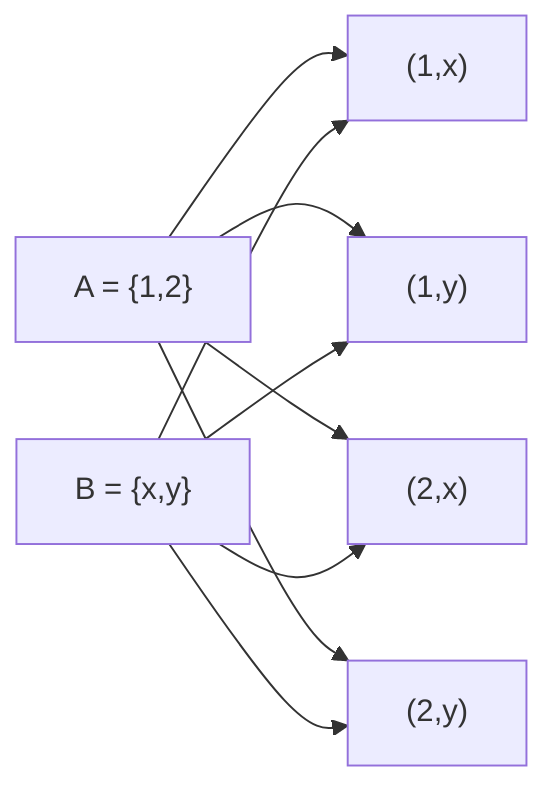

### 왜 중요한가

순서쌍이 생기면 관계와 함수를 모두 집합으로 표현할 수 있다.

---

## 7. 관계

관계(relation)는 $A \times B$의 부분집합이다.

즉, $R \subseteq A \times B$이면 R은 A에서 B로 가는 관계이다.

$(a,b) \in R$일 때 보통 $aRb$라고 쓴다.

예:

- = 는 동치관계의 예
- ≤ 는 순서관계의 예
- “친구이다”, “크다”, “포함된다”도 관계로 볼 수 있다

### 동치관계

다음 세 조건을 만족하면 동치관계이다.

1. 반사성: a ~ a
2. 대칭성: a ~ b이면 b ~ a
3. 추이성: a ~ b이고 b ~ c이면 a ~ c

### 순서관계

부분순서의 대표 조건:

1. 반사성: a ≤ a
2. 반대칭성: a ≤ b이고 b ≤ a이면 a=b
3. 추이성: a ≤ b이고 b ≤ c이면 a ≤ c

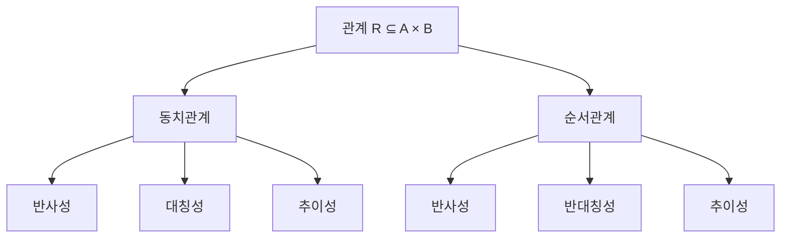

---

## 8. 함수

함수(function)는 특별한 관계이다. 직관적으로는 “입력마다 출력이 하나씩 정해지는 규칙”이다.

$f$가 $A$에서 $B$로 가는 함수라는 것은 다음을 의미한다.

- 정의역(domain): A
- 공역(codomain): B
- 모든 $a \in A$에 대해 정확히 하나의 $b \in B$가 존재하여 $f(a)=b$

$$
f: A \to B
$$

### 함수의 핵심 조건

1. 입력이 빠지면 안 된다.
2. 입력 하나에 출력이 둘이면 안 된다.

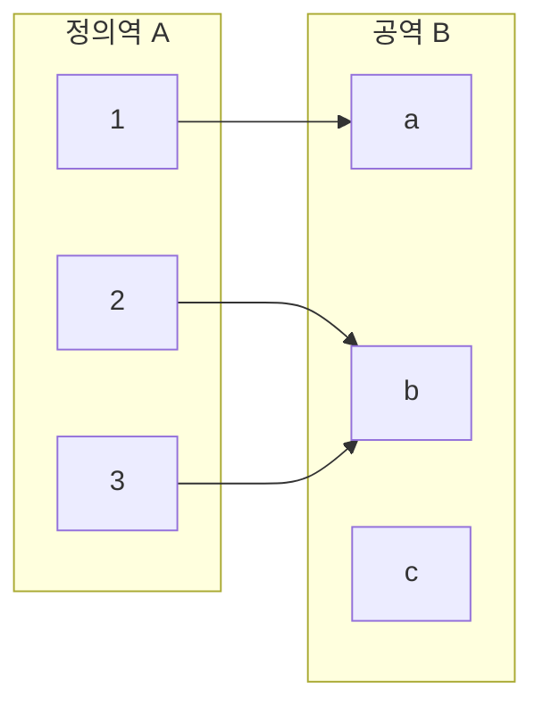

### 단사, 전사, 전단사

- **단사(injective)**: 서로 다른 입력은 서로 다른 출력으로 간다.
- **전사(surjective)**: 공역의 모든 원소가 실제로 값으로 나온다.
- **전단사(bijective)**: 단사이면서 전사이다.

전단사는 두 집합의 “크기”를 비교할 때 중요하다.

---

## 9. 자연수와 귀납법

집합론에서는 자연수도 하나의 구조로 볼 수 있다. 중요한 것은 단지 1,2,3,...를 쓰는 것이 아니라, **후속자(successor)** 와 **귀납적 구조**를 이해하는 것이다.

### 귀납법

어떤 명제 P(n)에 대해,

1. P(0)이 참이고,
2. P(n)이 참이면 P(n+1)도 참이면,
3. 모든 자연수 n에 대해 P(n)이 참이다.

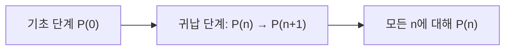

### 왜 중요한가

자연수는 단순한 숫자 목록이 아니라, 반복과 생성의 형식을 보여 준다. 이후 순서수 개념으로도 이어진다.

---

## 10. 선택공리

선택공리(axiom of choice)는 “각 집합들에서 하나씩 원소를 고르는 선택함수가 존재한다”는 주장이다.

직관적으로는 다음과 비슷하다.

- 상자들이 많이 있다.
- 각 상자에는 적어도 하나의 물건이 들어 있다.
- 각 상자에서 하나씩 꺼내는 규칙을 만들 수 있다.

유한한 경우에는 당연하게 느껴진다. 그러나 무한히 많은 집합들에 대해선 결코 자명하지 않다.

### 왜 중요한가

선택공리는 여러 강력한 정리와 연결된다.

- 잘순서정리
- 초른의 보조정리
- 최대 원리

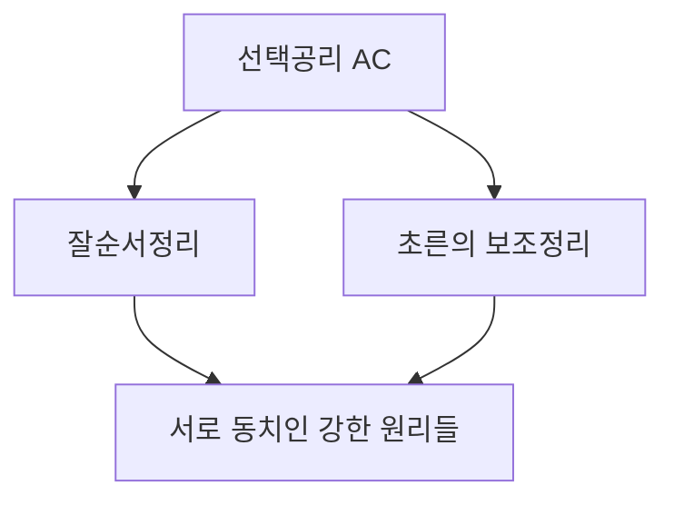

> 엄밀하게는 ZF 안에서 선택공리, 잘순서정리, 초른의 보조정리는 서로 동치이다.

---

## 11. 순서와 잘순서

순서관계가 주어졌다고 해서 언제나 자연수처럼 잘 정렬되는 것은 아니다.

### 선형순서

모든 두 원소가 비교 가능하면 선형순서(total order)이다.

예:

- 자연수의 ≤
- 실수의 ≤

### 잘순서

공집합이 아닌 모든 부분집합이 **최소원소**를 가지면 잘순서(well-order)이다.

자연수는 잘순서이지만, 정수나 실수는 표준 순서에서 잘순서가 아니다.

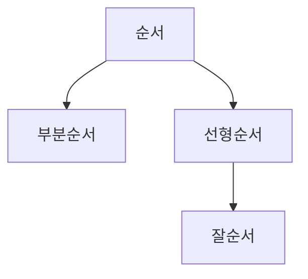

### 왜 중요한가

잘순서는 초한귀납법과 순서수 개념으로 이어진다. 유한을 넘어서는 “정렬된 무한”을 다룰 수 있게 해준다.

---

## 12. 순서수

순서수(ordinal number)는 잘순서 집합의 순서형(order type)을 추상화한 것이다. 간단히 말해 “몇 번째인가”를 무한까지 확장한 개념이다.

- 유한 순서수: 0,1,2,3,...
- 첫 번째 무한 순서수: $\omega$

### 순서수의 핵심 직관

- 기수는 “얼마나 많은가”를 말한다.
- 순서수는 “어떤 순서 구조를 가지는가”를 말한다.

예를 들어 $1 + \omega = \omega$ 이지만 $\omega + 1$은 다르다. 순서가 중요하기 때문이다.

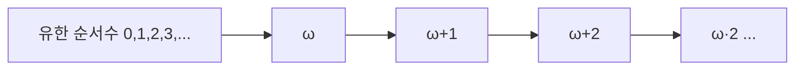

---

## 13. 기수

기수(cardinal number)는 집합의 “크기”를 나타낸다. 유한집합에서는 그냥 원소의 개수다. 무한집합에서는 **전단사**를 통해 크기를 비교한다.

### 같은 크기

두 집합 $A, B$ 사이에 전단사가 있으면 두 집합의 기수는 같다.

$$
|A| = |B|
$$

예:

- 자연수 집합 $\mathbb{N}$과 짝수 집합은 같은 크기이다.
- 무한집합에서는 진부분집합이 원래 집합과 같은 크기를 가질 수 있다.

### 가산과 비가산

- **가산(countable)**: 자연수와 일대일 대응 가능
- **비가산(uncountable)**: 자연수와 일대일 대응 불가

실수 집합 $\mathbb{R}$은 비가산이다. 칸토어의 대각선 논법이 이를 보여 준다.

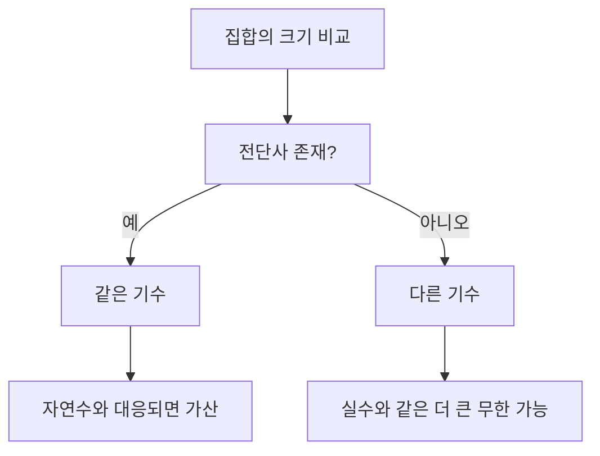

---

## 14. 집합론의 핵심 흐름 요약

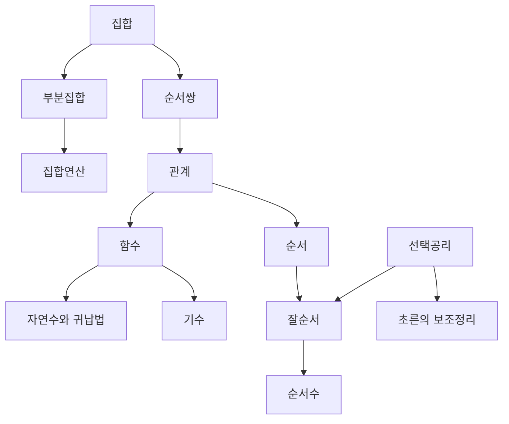

이 흐름만 제대로 이해해도 집합론의 언어를 읽을 수 있게 된다.

---

## 15. 집합론과 온톨로지의 연결

집합론은 존재론 자체와 동일하지는 않지만, 형식적 분류를 훈련하는 데 매우 유익하다.

### 연결되는 지점

1. **개체와 속성의 구분**  
   집합의 원소, 관계, 함수 개념은 개체·속성·관계의 형식화에 도움을 준다.

2. **분류와 계층**  
   부분집합과 멱집합은 클래스 계층을 이해하는 데 기초가 된다.

3. **관계 구조**  
   온톨로지에서 객체 간 관계를 다루려면 관계와 함수 개념이 중요하다.

4. **형식적 엄밀성**  
   “무엇이 허용되는 구성인가”라는 질문은 공리적 태도와 연결된다.

### 하지만 주의할 점

집합론이 곧바로 존재론적 실재를 말해 주는 것은 아니다. 집합론은 **형식적 도구**이고, 존재론은 **무엇이 존재하는가**를 묻는 철학적 탐구이다. 둘은 연결되지만 동일하지 않다.

---

## 16. 무엇을 어디까지 배워야 하나

입문 단계에서는 다음 정도면 충분하다.

### 반드시 익힐 것

- 집합과 원소
- 부분집합
- 집합 연산
- 순서쌍
- 관계
- 함수
- 자연수와 귀납법
- 선택공리의 의미
- 잘순서, 순서수, 기수의 기본 직관

### 한 번은 이해할 것

- 러셀의 역설
- 왜 공리적 집합론이 필요한가
- ZFC가 무엇의 약자인가

### 나중에 필요하면 볼 것

- 치환 공리의 정교한 쓰임
- 초한귀납법의 엄밀한 전개
- 선택공리의 독립성
- 연속체 가설
- 강제법, 큰 기수

---

## 17. 공부 순서 제안

1. 집합, 부분집합, 연산
2. 순서쌍, 관계, 함수
3. 자연수와 귀납법
4. 순서와 잘순서
5. 순서수와 기수
6. 선택공리와 초른의 보조정리
7. 공리적 집합론의 필요성

이 정도 흐름을 이해하면, 이후 수학 기초·논리학·형식 존재론·OWL 같은 주제로 자연스럽게 넘어갈 수 있다.

---

## 18. 참고 문헌

- Paul R. Halmos, *Naive Set Theory*.
- Herbert B. Enderton, *Elements of Set Theory*.
- Keith Devlin, *The Joy of Sets*.

